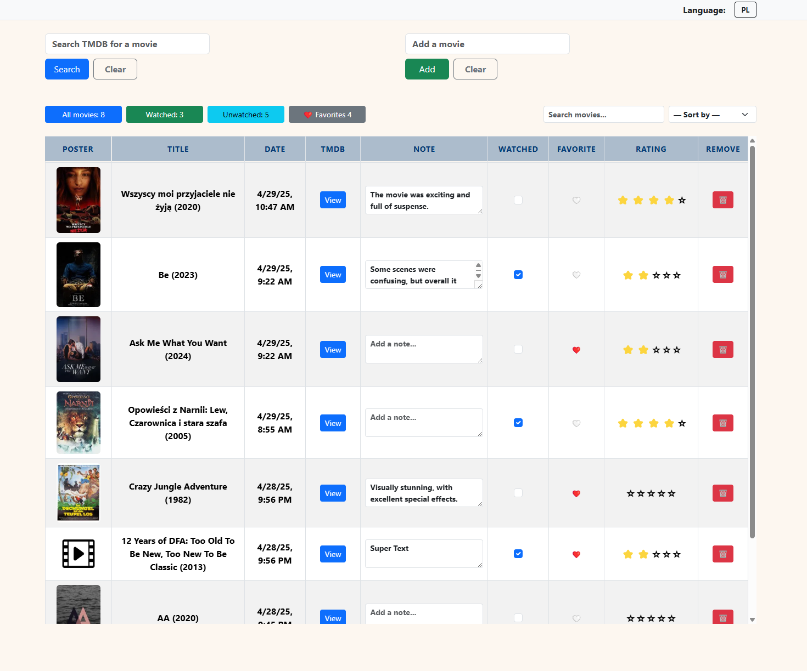
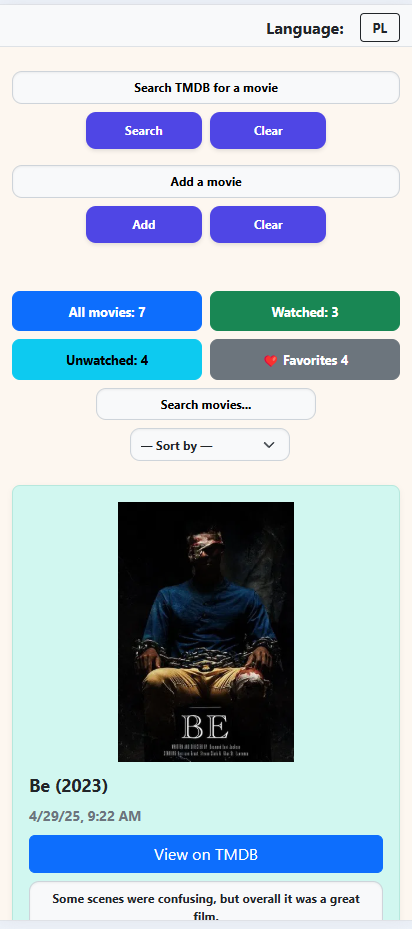

# 🎬 Movie Watchlist

A simple and fast movie watchlist app using **Express**, **SQLite**, and the **TMDB API**.

---

## 📸 Application preview



---

<p align="center">
  
</p>


## 📌 Project Description

A modern **movie watchlist** app built using **vanilla JavaScript**, **Node.js**, and **SQLite**.  
It allows you to search movies from TMDB, add them to your collection, rate them, mark as watched/unwatched, add notes, and more.

Key features include:

- 🔎 Search movies via **TMDB API**
- ✔️ Mark as watched / unwatched
- ❤️ Favorite movies
- ⭐ Rate from 1 to 5 stars
- 📝 Add personal notes
- 📊 Sort by title or date
- 🔍 Local search with filtering
- 🌐 Language toggle: **PL** / **EN**
- 💾 Data stored in **SQLite**
- 📱 Mobile-friendly layout (Bootstrap 5)

No frontend frameworks – just **HTML**, **CSS**, and **vanilla JavaScript**.

---

## 🧪 Tech Stack

- **Frontend**: HTML, CSS (Bootstrap), JS
- **Backend**: Express.js
- **Database**: SQLite (via `better-sqlite3`)
- **API**: TMDB (The Movie Database)

---

## 🚀 Getting Started

### 1. Clone the repo

```bash
git clone https://github.com/Kornetas/movie-watchlist.git
cd movie-watchlist
```

### 2. Install dependencies

```bash
npm install
```

### 3. Set up environment variables

Create a `.env` file in the root:

```env
TMDB_API_KEY=your_tmdb_api_key_here
```

### 4. Start the server

```bash
npm start
```

App runs at:  
👉 `http://localhost:3000`

---

## 🗂 Project Structure

```
movie-watchlist/
│
├── public/                   # Static frontend files
│   ├── css/
│   │   └── style.css         # Styles
│   ├── img/                  # Poster assets
│   ├── js/                   # JavaScript modules
│   │   ├── cardRenderer.js
│   │   ├── filterUtils.js
│   │   ├── language.js
│   │   ├── main.js
│   │   ├── manualAdd.js
│   │   ├── modalHandler.js
│   │   ├── movieList.js
│   │   ├── movieRenderer.js
│   │   ├── search.js
│   │   └── tableRenderer.js
│   └── index.html            # Main UI
│
├── routes/                   # Express routes
│   ├── movies.js
│   └── search.js
│
├── movieRepository.js        # SQLite interface
├── movies.db                 # SQLite database file
├── server.js                 # Entry point server
├── .env                      # TMDB API Key
├── .gitignore
├── package.json
└── README.md
```

---

## 👤 Author

Developed by [Kornetas](https://github.com/Kornetas)
